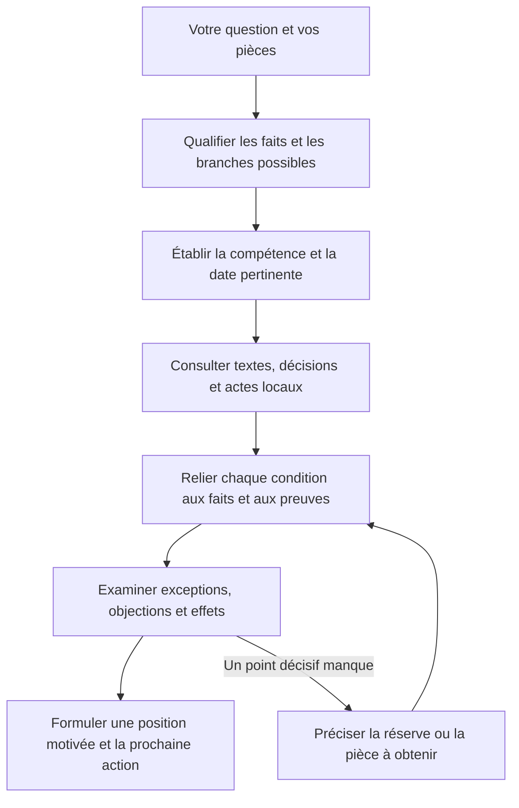
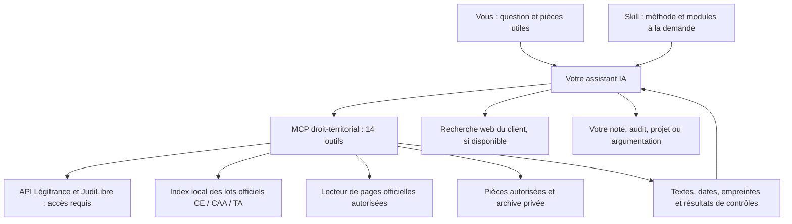

<p align="center">
  
</p>

# Juriste territorial

### Du droit à la décision.

**Donnez à votre assistant IA une méthode pour analyser vos dossiers, construire une argumentation et préparer vos décisions territoriales.**

Pensé pour les juristes, directions générales, services RH et agents des collectivités, **Juriste territorial** associe une méthode de raisonnement, **11 domaines métier** et un **serveur MCP de 14 outils** pour rechercher, consulter et contrôler les éléments d’un dossier.

<p align="center">
  <a href="https://github.com/didou92i/juriste-territorial/releases/download/v0.3.0/juriste-territorial-0.3.0.zip"><strong>Télécharger le skill</strong></a>
  &nbsp; · &nbsp;
  <a href="#installer-le-mcp"><strong>Installer le MCP</strong></a>
  &nbsp; · &nbsp;
  <a href="docs/parcours-dossier.md"><strong>Voir un dossier en pratique</strong></a>
</p>

<p align="center">
  <a href="https://github.com/didou92i/juriste-territorial/actions/workflows/ci.yml"></a>
</p>

[La méthode](#une-méthode-pour-construire-votre-position) · [Les domaines](#le-droit-des-collectivités-au-centre) · [Les connexions](#les-sources-consultées) · [Les garanties et limites](#une-confiance-fondée-sur-des-éléments-vérifiables)

## Ce que vous pouvez lui confier

| Votre besoin | Le travail que la méthode guide |
|---|---|
| **Analyser une question juridique** | Qualifier les faits, retrouver les règles pertinentes et expliquer leur application au dossier. |
| **Examiner un acte ou une décision** | Contrôler compétence, délégations, dates, conditions et pièces nécessaires ; proposer les corrections motivées. |
| **Préparer une note à la direction** | Présenter une position argumentée, les points décisifs, les réserves utiles et la prochaine action. |
| **Étudier une jurisprudence** | Distinguer arguments des parties, motifs du juge, dispositif et conditions de transposition. |
| **Préparer un recours ou une réponse** | Séparer recevabilité, moyens, preuves, effets recherchés et options praticables. |
| **Réexaminer un dossier** | Comparer les preuves conservées, identifier ce qui a changé et apprécier la conséquence juridique. |

Les livrables sont préparés par votre assistant à partir du skill. Leur qualité dépend des pièces, des sources accessibles et du modèle utilisé ; les décisions sensibles restent soumises à votre examen juridique.

## Une méthode pour construire votre position

Le cœur du projet est **l’articulation entre la règle, ses conditions et les faits du dossier**. Le skill demande à l’assistant de rendre cette justification vérifiable et d’examiner l’objection susceptible de changer la réponse.



### Les questions qui font la différence

- **Qui agit, et à quel titre ?** Identifier la personne morale, l’organe compétent et les délégations réellement établies.
- **Quel droit, à quelle date ?** Distinguer le fait générateur, la version du texte et les informations connues au moment de l’analyse.
- **Que prouve chaque pièce ?** Séparer faits établis, déclarés, contestés, inférés et manquants.
- **Pourquoi cette règle s’applique-t-elle ici ?** Relier conditions, pièces, application et conséquences.
- **Qu’est-ce qui pourrait faire basculer la solution ?** Chercher l’exception, la qualification concurrente ou l’argument adverse le plus solide.
- **Que peut-on faire maintenant ?** Proposer une action proportionnée aux éléments effectivement établis.

**Exemple de raisonnement.** Un projet de contrat est signé par une directrice et vise une délégation. Le skill guide la lecture de cette délégation, de son champ, des éventuelles exclusions et des annexes. Si une annexe décisive manque, la réponse précise le point à vérifier et prépare la suite du dossier.

→ [Suivre un dossier du début à la restitution](docs/parcours-dossier.md) · [Lire la méthode complète](skills/juriste-territorial/references/methode.md)

## Le droit des collectivités au centre

Les modules sont chargés selon la question. Chaque domaine apporte ses points de vigilance et ses pistes de recherche autour du même noyau méthodologique.

| Domaine | Principaux sujets |
|---|---|
| [Institutions et intercommunalité](skills/juriste-territorial/modules/institutions.md) | Compétences, transferts, organes et délégations |
| [Actes administratifs](skills/juriste-territorial/modules/actes.md) | Délibérations, arrêtés, visas, annexes et caractère exécutoire |
| [Fonction publique territoriale](skills/juriste-territorial/modules/fpt.md) | Carrière, temps de travail, rémunération et discipline |
| [Dialogue social](skills/juriste-territorial/modules/dialogue-social.md) | CST, mandats, garanties et gouvernance syndicale |
| [Commande publique](skills/juriste-territorial/modules/commande-publique.md) | Besoin, procédure, exécution et modifications |
| [Police](skills/juriste-territorial/modules/police.md) | Compétences, pouvoirs de police et proportionnalité |
| [Finances](skills/juriste-territorial/modules/finances.md) | Budget, subventions, conventions et compétence financière |
| [Urbanisme et patrimoine](skills/juriste-territorial/modules/urbanisme-patrimoine.md) | Urbanisme, environnement, domaine et occupations |
| [Services publics](skills/juriste-territorial/modules/services-publics.md) | Accès, égalité, tarifs et documents administratifs |
| [Données et numérique](skills/juriste-territorial/modules/donnees-numerique.md) | Données personnelles, numérique, IA et sécurité |
| [Contentieux](skills/juriste-territorial/modules/contentieux.md) | Recevabilité, urgence, moyens, mémoire et effets recherchés |

**Ce sont des guides métier expérimentaux.** Leur présence indique un périmètre d’analyse ; la couverture juridique de chaque domaine doit encore être qualifiée par des relecteurs humains.

## Comment le skill et le MCP travaillent ensemble

Un **skill** est un ensemble d’instructions et de références que votre assistant charge pour travailler selon une méthode. **MCP** signifie *Model Context Protocol* : un protocole permettant à l’assistant d’appeler des outils.

Le projet fournit **un serveur MCP, `droit-territorial`**. Ses adaptateurs interrogent les sources ou lisent les documents disponibles. Le raisonnement et la rédaction sont réalisés par le modèle de votre assistant, guidé par le skill.



Le téléchargement du skill apporte la méthode. L’installation du MCP ajoute ses outils. L’activation des API dépend des accès de l’utilisateur ; la recherche web dépend des capacités de son client.

### Les 14 outils, par usage

| Usage | Outils |
|---|---|
| Choisir la méthode et connaître les accès | `get_methodology`, `get_source_status` |
| Rechercher et lire les sources | `search`, `fetch`, `search_case_law`, `search_admin_archive` |
| Examiner versions et renvois | `get_legal_version`, `compare_versions`, `resolve_references` |
| Retrouver les pièces de travail | `search_local_acts` |
| Contrôler citations, dossier et changements | `check_evidence`, `review_case`, `compare_evidence` |
| Vérifier deux règles monétaires bornées | `evaluate_rule` |

Le contrat de chaque outil précise ses entrées et ses limites. Les contrôles automatiques portent notamment sur les références, citations, dates et accès ; **ils ne certifient ni le sens d’une citation ni la validité d’une conclusion**.

→ [Consulter le contrat MCP](skills/juriste-territorial/references/outils.md)

## Les sources consultées

**Le mécanisme de chaque connexion et son état sont explicités ci-dessous.** Un adaptateur livré doit être distingué d’un accès effectivement configuré et testé sur votre poste.

| Source | Accès prévu dans le projet | État documenté |
|---|---|---|
| **Légifrance / PISTE** | API pour codes, textes, JORF, recherche jurisprudentielle, articles datés et comparaison de versions | Adaptateur livré et contrats simulés testés. Identifiants et souscription nécessaires ; recette authentifiée encore à réaliser. |
| **Open data de la justice administrative** | Import opérateur des ZIP/XML officiels, index local et filtres CE/CAA/TA | Trois lots officiels réellement importés : **522 décisions** ; trois recherches et consultations intégrales contrôlées. Couverture limitée aux lots importés. |
| **ArianeWeb** | Recherche web du client et lecture de pages officielles accessibles | Parcours web documenté ; aucun moteur de recherche ArianeWeb autonome intégré au MCP. |
| **JudiLibre / PISTE** | API de jurisprudence judiciaire, consultation et taxonomie | Adaptateur livré et contrats simulés testés. Accès requis ; recette authentifiée encore à réaliser. Le juge administratif relève des autres sources. |
| **DGCL, DAJ, CNIL, CADA, DINUM et sites européens autorisés** | Lecteur de pages HTTPS sur une liste explicite de domaines | Lecture selon l’accessibilité de la page ; recherche fournie par le client. Aucun accès universel aux bases des institutions. |
| **Vos actes et pièces locales** | Import volontaire de fichiers `.txt`/`.md` dans une base locale, recherche par identité et dossier | Accès, retraits et intégrité testés sur documents fictifs. Conversion PDF/DOCX/OCR à effectuer en amont avec vos outils. |

PISTE est la plateforme d’accès aux API concernées. Le dépôt livre ces adaptateurs dans son propre MCP ; il ne préconfigure pas de connexions à des serveurs MCP juridiques tiers.

Les portails de référence et capacités détaillées figurent dans le [registre des sources](registry/sources.json). L’outil `get_source_status` expose la configuration locale et les opérations observées. Une panne, un accès manquant, une version inconnue et une recherche sans résultat sont traités distinctement.

→ [Comprendre les connexions et les flux de données](docs/connexions-et-donnees.md) · [Utiliser l’index administratif](docs/admin-index.md)

## Commencer avec votre prochain dossier

### Utiliser le skill

1. **[Télécharger le ZIP du skill](https://github.com/didou92i/juriste-territorial/releases/download/v0.3.0/juriste-territorial-0.3.0.zip).**
2. Décompresser le dossier `juriste-territorial` dans le répertoire de skills de votre client compatible.
3. Ouvrir une nouvelle session, vérifier que le skill est disponible et lui soumettre un premier dossier.

```text
Utilise $juriste-territorial pour analyser ce dossier.

Mon objectif : préparer une note pour la direction.
Les faits et les pièces disponibles : […]
La date pertinente : […]

Présente la position proposée, les conditions déterminantes,
les références vérifiées, l’objection la plus solide
et la prochaine action utile.
```

Le skill peut utiliser les outils web de votre assistant sans clé PISTE. Il conserve sa méthode lorsque certaines sources sont indisponibles et doit signaler les références non vérifiées.

### Installer le MCP

Avec **Python 3.12+ et `uv`** :

```bash
git clone https://github.com/didou92i/juriste-territorial.git
cd juriste-territorial
uv sync --frozen --extra credentials
uv run --frozen --extra credentials droit-territorial status
uv run --frozen --extra credentials droit-territorial serve
```

Enregistrer ensuite le serveur dans votre client avec la [configuration documentée](docs/compatibility.md). Lancer le serveur en terminal ne l’ajoute pas automatiquement à votre assistant.

### Vos accès, guidés dès le premier échange

Le MCP indique les sources disponibles et les identifiants manquants. L'assistant
vous guide pour activer **Légifrance avec votre propre application PISTE** ; JudiLibre
reste facultatif. La méthode et les index configurés restent utilisables sans ces clés.

```bash
uv run --frozen --extra credentials droit-territorial configure piste
JT_CREDENTIAL_STORE=keyring uv run --frozen --extra credentials droit-territorial doctor --probe
```

**Saisie masquée, stockage dans le trousseau système, aucun secret dans le chat.**
Le diagnostic distingue identifiants présents, recherche et lecture réussies, refus
d'accès, quota atteint et résultat vide. Sur un hébergement, les variables sont
fournies par votre gestionnaire de secrets.

→ [Activer Légifrance et les autres sources](skills/juriste-territorial/references/installation.md)

Le mode **stdio local** permet un usage individuel avec pièces privées configurées. Le transport HTTP fourni est limité à `127.0.0.1` et désactive les magasins locaux. Une connexion distante à une application nécessite un déploiement et une authentification adaptés.

→ [Installation, accès API et compatibilité](docs/compatibility.md) · [Toutes les archives de la distribution](https://github.com/didou92i/juriste-territorial/releases/tag/v0.3.0)

## Une confiance fondée sur des éléments vérifiables

| Ce qui est vérifié | Ce que cela démontre |
|---|---|
| **145 tests réussis, 1 ignoré** dans la validation publiée | Fonctionnement technique des contrats, règles bornées, accès, preuves et protocoles testés |
| **MCP stdio et HTTP local** avec un client SDK réel | Initialisation, découverte et appels des outils, ressources et prompt |
| **522 décisions administratives importées** | Lecture de trois lots officiels et conservation des métadonnées ; trois consultations détaillées vérifiées |
| **Six dossiers fictifs de développement** et essais distincts par agent | Matériel de recette et premiers comportements observés |
| **Registres, empreintes et rapports accessibles** | Possibilité de retrouver la portée et les limites des vérifications annoncées |

**Le projet est un pilote expérimental.** Les connexions PISTE authentifiées, le benchmark comparatif avec relecture juridique humaine et la robustesse nationale de la recherche restent à démontrer. Les résultats ci-dessus ne mesurent pas un taux général de fiabilité juridique.

Les preuves et notes peuvent être conservées dans une archive privée facultative. Les bases sont locales ; **les extraits renvoyés à votre assistant sont traités selon la configuration de son modèle et de son fournisseur**. Le choix d’un MCP local ne rend pas, à lui seul, tout le traitement local.

→ [Lire le rapport de validation](docs/validation.md) · [Comprendre la conservation des dossiers](docs/case-records.md) · [Examiner le protocole d’évaluation](evals/README.md)

## Un projet ouvert et structuré pour évoluer

```text
skills/juriste-territorial/   Méthode, 11 modules et gabarits
src/droit_territorial/       Serveur MCP, sources et contrôles
registry/                   Règles datées, sources et couverture
evals/                      Dossiers fictifs et protocole d’évaluation
tests/                      Vérifications techniques et régressions
docs/                       Installation, architecture et rapports
```

La méthode possède une source canonique, partagée par le ZIP du skill et le paquet MCP. Les règles, sources, évaluations et logiciels ont des rôles séparés. Les versions et rapports conservent la trace des changements.

Les contributions les plus utiles aujourd’hui : **des dossiers territoriaux nouveaux, des relectures juridiques indépendantes et des recettes de connexions officielles**. Décrire les cas sans transmettre de pièces privées ou de données personnelles dans une issue publique.

[Architecture](docs/architecture.md) · [Maintenance](docs/maintenance.md) · [Plan de développement](docs/development-plan.md) · [Ouvrir une discussion dans les issues](https://github.com/didou92i/juriste-territorial/issues)

<details>
<summary><strong>Commandes de vérification et de construction</strong></summary>

```bash
uv run --frozen pytest
uv run --frozen ruff check .
uv run --frozen ruff format --check .
uv run --frozen python scripts/check_distribution.py
uv build
uv run --frozen python scripts/package_skill.py
```

</details>

---

**Code sous MIT · Méthode et documentation sous CC BY-SA 4.0.** Méthode adaptée avec attribution à @brissonjo-sudo ; détail des reprises dans [NOTICE.md](NOTICE.md), [THIRD_PARTY.yml](THIRD_PARTY.yml) et la [revue des dépôts sources](docs/source-review.md).

[Commencer avec le skill](https://github.com/didou92i/juriste-territorial/releases/download/v0.3.0/juriste-territorial-0.3.0.zip) · [Explorer les nouveautés](docs/release-0.3.0.md) · [Consulter les licences](LICENSE.md)
